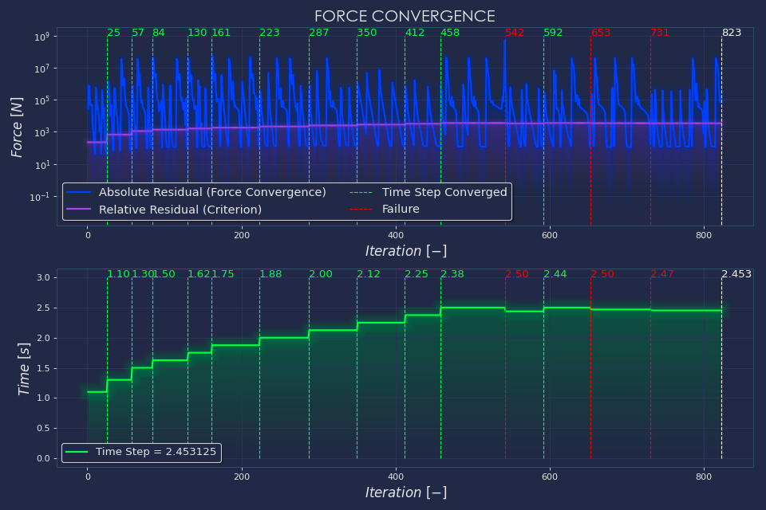
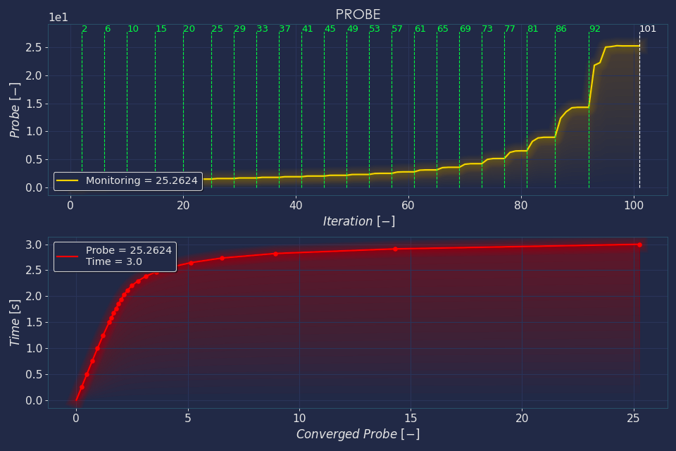
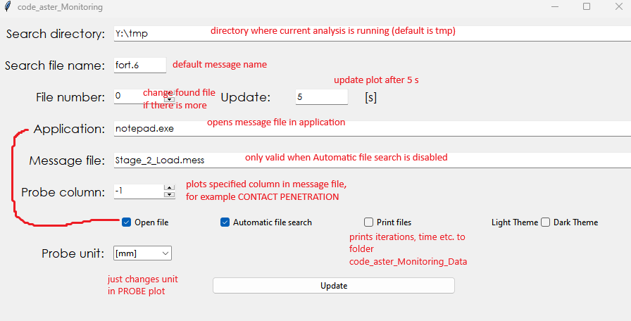

# code_aster Monitoring

A python script that I created a while ago for monitoring nonlinear analysis using just a message file.
The output is similar to other commercial fea software.

    
    

## How to use

Just run code_aster_Monitoring_GUI.py

    

